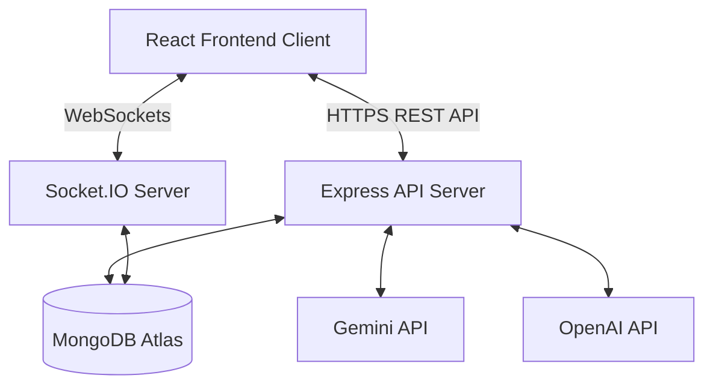

# 🏗️ Architecture Design Document

This document outlines the technical architecture of **DevCollab**, a modern real-time AI-powered project collaboration platform.

---

## 🗺️ System Overview

DevCollab is built on a decoupled, full-stack client-server architecture:
- **Frontend Client**: A Single Page Application (SPA) built with React 18 and Vite, styled using Tailwind CSS and Framer Motion, utilizing Zustand for state management.
- **Backend API**: A Node.js and Express RESTful server integrated with Socket.IO for WebSocket events.
- **Database**: MongoDB Atlas utilized for persistent storage through Mongoose ODM.
- **AI Core**: Connects with Gemini and OpenAI APIs for code reviews, standups, and chat assistance.

---

## 🗄️ Database Schemas (Mongoose Models)

All database collections are hosted on MongoDB Atlas. Here are the schemas defined under `server/src/models/`:

### 1. User (`User.js`)
- `name`: String, required.
- `email`: String, required, unique.
- `password`: String, required (hashed using bcryptjs).
- `avatar`: String (URL or base64).
- `isOnline`: Boolean.
- `lastSeen`: Date.

### 2. Workspace (`Workspace.js`)
Workspaces are the top-level container for users and projects.
- `name`: String, required.
- `description`: String.
- `owner`: Schema.Types.ObjectId -> User.
- `members`: Array of objects:
  - `user`: Schema.Types.ObjectId -> User.
  - `role`: String ('owner', 'admin', 'member').
- `inviteCode`: String, unique (used for workspace onboarding).

### 3. Project (`Project.js`)
Projects sit within workspaces and house Kanban boards.
- `name`: String, required.
- `description`: String.
- `workspace`: Schema.Types.ObjectId -> Workspace, required.
- `createdBy`: Schema.Types.ObjectId -> User.
- `members`: Array of User ObjectIDs.

### 4. Task (`Task.js`)
Kanban board items.
- `title`: String, required.
- `description`: String.
- `status`: String ('todo', 'in_progress', 'review', 'done'), default 'todo'.
- `priority`: String ('low', 'medium', 'high'), default 'medium'.
- `project`: Schema.Types.ObjectId -> Project, required.
- `assignees`: Array of User ObjectIDs.
- `tags`: Array of strings.
- `dueDate`: Date.
- `aiBreakdown`: Array of strings (generated via AI).

### 5. Snippet (`Snippet.js`)
Shared code repository snippets.
- `title`: String.
- `code`: String, required.
- `language`: String (e.g. javascript, python).
- `workspace`: Schema.Types.ObjectId -> Workspace.
- `createdBy`: Schema.Types.ObjectId -> User.

---

## 🔌 State Management (Zustand Stores)

The React client manages state globally using **Zustand** stores located under `client/src/store/`:

1. **`authStore.js`**:
   - Manages logged-in user state (`user`, `token`, `isAuthenticated`).
   - Handles login, registration, password updates, and logout actions.
2. **`workspaceStore.js`**:
   - Holds the list of workspaces, current active workspace, stats, and member details.
   - Manages invitations and workspace settings.
3. **`projectStore.js`**:
   - Handles active projects, lists, and Kanban tasks (including optimistic updates when dragging cards).
4. **`socketStore.js`**:
   - Connects, disconnects, and manages the client's active Socket.IO connection.
5. **`notificationStore.js`**:
   - Maintains real-time workspace notifications and read/unread status.
