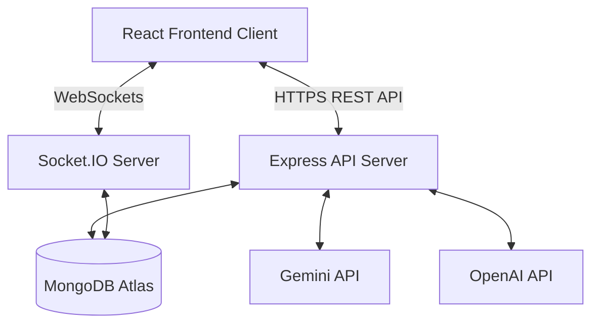

# 📖 DevCollab Complete Consolidated Developer Documentation

This consolidated guide serves as the single source of truth for the entire DevCollab codebase. It covers system architecture, complete database schemas, all API routes, WebSocket events, AI integrations, and scaling/deployment instructions.

---

## 🏗️ 1. System Architecture & Database Design

DevCollab is built on a decoupled, full-stack client-server architecture:
- **Frontend Client**: React 18, Vite, Tailwind CSS, Framer Motion, and Zustand for state management.
- **Backend API**: Node.js and Express RESTful server integrated with Socket.IO.
- **Database**: MongoDB Atlas utilized for persistent storage through Mongoose.
- **AI Core**: Connects with Gemini and OpenAI APIs for code reviews, standups, and chat.



### 🗄️ Database Schemas (Mongoose Models)

#### 1. User (`User.js`)
- `name`: String, required.
- `email`: String, required, unique.
- `password`: String, required (hashed using bcryptjs).
- `avatar`: String (URL or base64 string).
- `isOnline`: Boolean (updated dynamically on socket connect/disconnect).
- `lastSeen`: Date.

#### 2. Workspace (`Workspace.js`)
- `name`: String, required.
- `description`: String.
- `owner`: Schema.Types.ObjectId -> User.
- `members`: Array of objects:
  - `user`: Schema.Types.ObjectId -> User.
  - `role`: String ('owner', 'admin', 'member').
- `inviteCode`: String, unique (used for workspace onboarding).

#### 3. Project (`Project.js`)
- `name`: String, required.
- `description`: String.
- `workspace`: Schema.Types.ObjectId -> Workspace, required.
- `createdBy`: Schema.Types.ObjectId -> User.
- `members`: Array of User ObjectIDs.

#### 4. Task (`Task.js`)
- `title`: String, required.
- `description`: String.
- `status`: String ('todo', 'in_progress', 'review', 'done'), default 'todo'.
- `priority`: String ('low', 'medium', 'high'), default 'medium'.
- `project`: Schema.Types.ObjectId -> Project, required.
- `assignees`: Array of User ObjectIDs.
- `tags`: Array of strings.
- `dueDate`: Date.
- `aiBreakdown`: Array of strings (subtasks generated via AI).

#### 5. Snippet (`Snippet.js`)
- `title`: String, required.
- `code`: String, required.
- `language`: String (e.g. javascript, python, css).
- `workspace`: Schema.Types.ObjectId -> Workspace.
- `createdBy`: Schema.Types.ObjectId -> User.

#### 6. Document (`Document.js`)
- `title`: String, required, trim: true.
- `content`: String, default: ''.
- `emoji`: String, default: '📄'.
- `project`: Schema.Types.ObjectId -> Project, required.
- `workspace`: Schema.Types.ObjectId -> Workspace, required.
- `author`: Schema.Types.ObjectId -> User, required.
- `lastEditedBy`: Schema.Types.ObjectId -> User.
- `parent`: Schema.Types.ObjectId -> Document, default: null (nested wiki pages).
- `isPublished`: Boolean, default: false.
- `tags`: Array of strings.
- `views`: Number, default: 0.
- `versions`: Array of versionSchema:
  - `content`: String, required.
  - `editedBy`: Schema.Types.ObjectId -> User.
  - `editedAt`: Date, default: Date.now.
  - `summary`: String, default: 'Updated document'.

#### 7. Notification (`Notification.js`)
- `recipient`: Schema.Types.ObjectId -> User, required.
- `sender`: Schema.Types.ObjectId -> User.
- `type`: String, enum: `['task_assigned', 'task_completed', 'task_commented', 'project_invite', 'mention', 'workspace_invite', 'task_moved', 'ai_suggestion']`, required.
- `title`: String, required.
- `message`: String, required.
- `link`: String, default: ''.
- `isRead`: Boolean, default: false.
- `metadata`: Mixed, default: {}.

### 🔌 State Management (Zustand Stores)

1. **`authStore.js`**: Manages logged-in user state (`user`, `token`, `isAuthenticated`).
2. **`workspaceStore.js`**: Holds the list of workspaces, active workspace, stats, and member details.
3. **`projectStore.js`**: Handles active projects, lists, and Kanban tasks (including optimistic updates).
4. **`socketStore.js`**: Connects, disconnects, and manages the client's active Socket.IO connection.
5. **`notificationStore.js`**: Maintains real-time workspace notifications.

---

## 🔌 2. API & Socket Reference

### 🌐 REST API Endpoints

#### Authentication (`/api/auth`)
- `POST /register`: Registers a new user account.
- `POST /login`: Log in to get JWT token.
- `POST /logout` (Protected): Invalidate session/logout.
- `GET /me` (Protected): Get the current user profile.
- `PUT /profile` (Protected): Edit profile name and avatar.
- `PUT /password` (Protected): Change account password.

#### Workspace Management (`/api/workspaces`)
- `GET /`: Retrieve all workspaces the user belongs to.
- `POST /`: Create a new workspace.
- `GET /:id`: Get details of a single workspace.
- `PUT /:id`: Update workspace metadata.
- `GET /:id/stats`: Get task completion metrics and member stats.
- `POST /:id/invite`: Invite a user to the workspace.
- `DELETE /:id/members/:userId`: Remove a member.

#### Projects (`/api/workspaces/:workspaceId/projects`)
- `GET /`: List all projects in a workspace.
- `POST /`: Create a project.
- `GET /:id`: Get project details and Kanban tasks.
- `PUT /:id`: Edit project details.
- `DELETE /:id`: Delete project and its tasks.
- `GET /:id/activity`: Fetch project activity logs.

#### Tasks (`/api/workspaces/:workspaceId/projects/:projectId/tasks`)
- `POST /`: Create a task.
- `PUT /:id`: Update task parameters.
- `PUT /:id/status`: Update status (Kanban column drag-and-drop).
- `DELETE /:id`: Remove a task.

#### Wiki Documents (`/api/workspaces/:workspaceId/projects/:projectId/documents`)
- `GET /`: Retrieve all wiki documents for a project.
- `POST /`: Create a document.
- `GET /:id`: Retrieve a document with historical versions.
- `PUT /:id`: Update a document (automatically appends a version history block).
- `DELETE /:id`: Delete a document.

#### Code Snippets (`/api/workspaces/:workspaceId/snippets`)
- `GET /`: Get snippets for the workspace.
- `POST /`: Create a new code snippet.
- `GET /:id`: Fetch a code snippet.
- `PUT /:id`: Edit code, title, or language.
- `DELETE /:id`: Delete a snippet.
- `POST /:id/copy`: Clone a snippet into the active user's workspace profile.

#### Notifications (`/api/notifications`)
- `GET /`: Fetch all user notifications.
- `PUT /mark-all-read`: Mark all notifications as read.
- `PUT /:id/read`: Mark a specific notification as read.
- `DELETE /:id`: Delete a notification.

#### Analytics (`/api/analytics`)
- `GET /:workspaceId`: Fetch overview metrics (e.g. task distributions, completion rates).
- `GET /:workspaceId/contributions`: Retrieve per-member performance metrics.

### ⚡ Socket.IO Real-time Events

#### Client to Server Events
- `workspace:join (workspaceId)`: Join a room dedicated to workspace presence.
- `project:join (projectId)`: Join a room dedicated to a project board.
- `task:create (data)`: Emitted when a new task is created.
- `task:update (data)`: Emitted when a task is edited.
- `task:move (data)`: Emitted when a task is moved to a new column.
- `typing:start (data)`: Emitted when a user starts editing/typing in a task.
- `typing:stop (data)`: Emitted when typing ceases.
- `presence:update (data)`: Emitted when user updates their status ('online', 'busy', 'away') or views a page.
- `notification:send (data)`: Dispatches a real-time notification to a specific recipient.

#### Server to Client Broadcasts
- `user:online ({ userId, user })`: Broadcast to all sockets when a user connects.
- `user:offline ({ userId })`: Broadcast to all sockets when a user disconnects.
- `user:joined ({ user, workspaceId })`: Emitted inside a workspace room when a member joins.
- `task:created (data)`: Emitted to a project room when a task is created.
- `task:updated (data)`: Emitted to a project room when a task is modified.
- `task:moved (data)`: Emitted to a project room when a task moves columns.
- `user:typing ({ userId, name, taskId })`: Broadcasts typing indicator.
- `user:stopped-typing ({ userId, taskId })`: Clears typing indicator.
- `presence:changed ({ userId, status, currentView })`: Updates workspace members on a user's location and active status.
- `notification:new (notification)`: Sent specifically to the recipient's private `user:${userId}` room.

---

## 🤖 3. AI Integration & Features

### AI Endpoints (`/api/ai`)
1. **AI Task Breakdown (`POST /api/ai/breakdown`)**: Generates structured subtasks, complexity rating, and hours estimation.
2. **Automated Daily Standup Reports (`POST /api/ai/standup`)**: Formulates a standup report from a user's past 24 hours activity.
3. **Project Summary (`GET /api/ai/projects/:projectId/summary`)**: Generates a progress report, overall health score, and risk factors.
4. **Real-time Code Reviewer (`POST /api/ai/review`)**: Analyzes code to find bugs, security holes, and style issues.
5. **Blocker Detection Agent (`GET /api/ai/projects/:projectId/blockers`)**: Identifies overdue tasks and potential bottlenecks.
6. **Chat Companion (`POST /api/ai/chat`)**: Answers questions and offers management guidance.

### Connecting Real AI APIs
Add the keys to `server/.env`:
```env
GEMINI_API_KEY=your_gemini_key
OPENAI_API_KEY=your_openai_key
```
And replace the mock response function in `server/src/controllers/aiController.js` using official `@google/generative-ai` or `openai` packages.

---

## 🚢 4. Deployment & Load Balancing

### Local Development Setup
1. Install dependencies in client and server.
2. Seed local DB with `npm run seed` inside `server`.
3. Start backend (`npm run dev`) and client (`npm run dev` in `client`).

### Clustered Load Balancer (Native Node.js)
Scale to all CPU cores locally or on a single machine by setting:
```env
ENABLE_CLUSTER=true
```
Run using:
```bash
npm run dev:server:cluster
```
- **Primary Process**: Intercepts TCP connections and stickily routes them.
- **Worker Processes**: Bind to IPC channels via `@socket.io/cluster-adapter` to distribute room messages across processes.

### Production Nginx Load Balancer Configuration
A template configuration is saved at `deployment/nginx.conf`:
- **Sticky Session routing**: Using the `ip_hash` directive.
- **WebSocket Upgrade Headers**:
  ```nginx
  proxy_set_header Upgrade $http_upgrade;
  proxy_set_header Connection "upgrade";
  ```
- **Timeouts**: Sets `proxy_read_timeout 7d` to preserve WebSocket connections.
